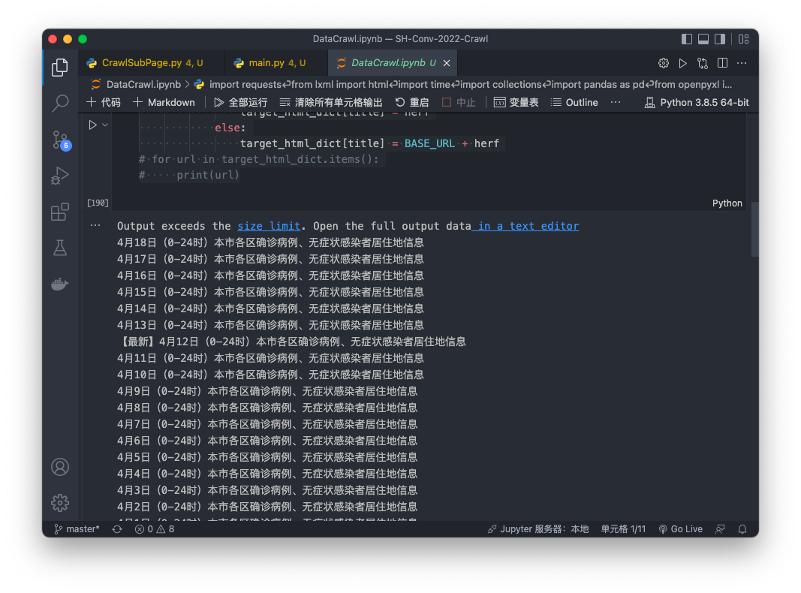
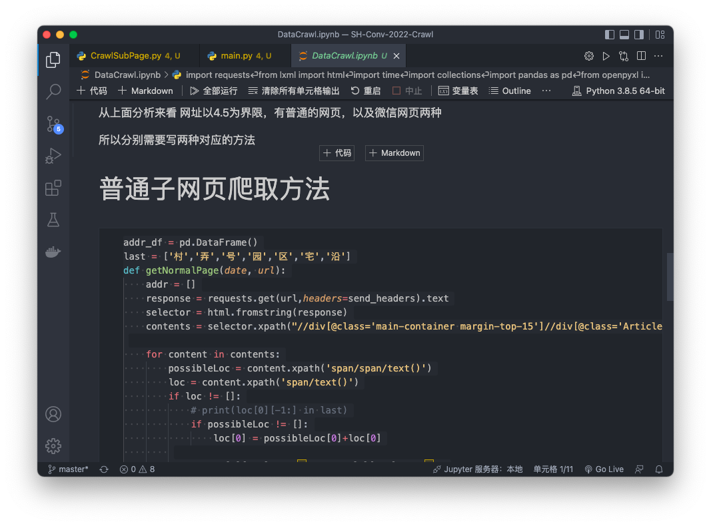
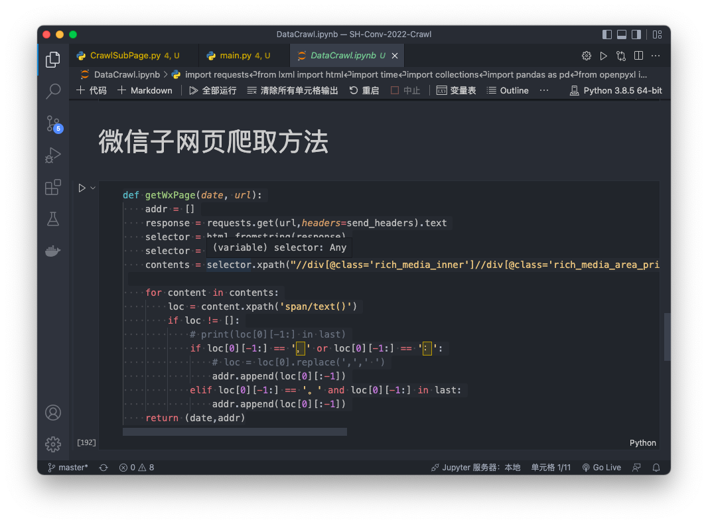

# SH-Conv-2022-Crawl
爬取上海发布中每日新增的地点

##  File Tree

```
.
├── DataCrawl.ipynb # 所有内容都有，可以完整爬取
├── LICENSE
├── README.md
├── data # 存放数据
│   └── data.xlsx
└── utils # 封装方法，待完善
    ├── CrawlSubPage.py
    └── main.py
```

## Usage

打开DataCrawl.ipynb，更改headers，添加cookies（可选），选择自己要爬取的页数

运行全部即可

## Screenshot





## Requiements

```
requests == 2.24.0
lxml == 4.6.3
pandas == 1.2.0
openpyxl == 3.0.7
```

*依赖版本仅供参考，并不一定严格要求

## Future Work

进一步封装，并设计定时爬取脚本
